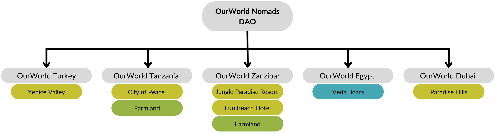

<!-- section 1 (co-found) -->



## BECOME A CO-FOUNDER IN OURWORLD NOMADS {#text-4xl}

Unique co-ownership structure of a diverse real-estate portfolio





  

|||

  

|||

  





### Become a co-owner of real estate assets on safe locations in the world. {#text-2xl}

|||

### Live In Unique Locations designed to the needs of Digital nomads.  {#text-2xl}

|||

### Make it possible to provide regenerative farming to our communities.  {#text-2xl}



<!-- section 3 (advantages) -->


To power OurWorld Digital Nomad DAO, we will create a Digital Nomad Token (DNT) which will act as a proof of co-ownership – providing token holders the following benefits:

- A seat in the OurWorld Digital Nomad governance system, overseeing the further developments of the community and its ecosystem

- Yield on future rental of properties and related infrastructure (energy, food, internet generation)
- Preferential access to homes, events and retreats in all locations
- Priority access to organic food reserves and internet capacity
- Ability to reserve premises/locations for private events


