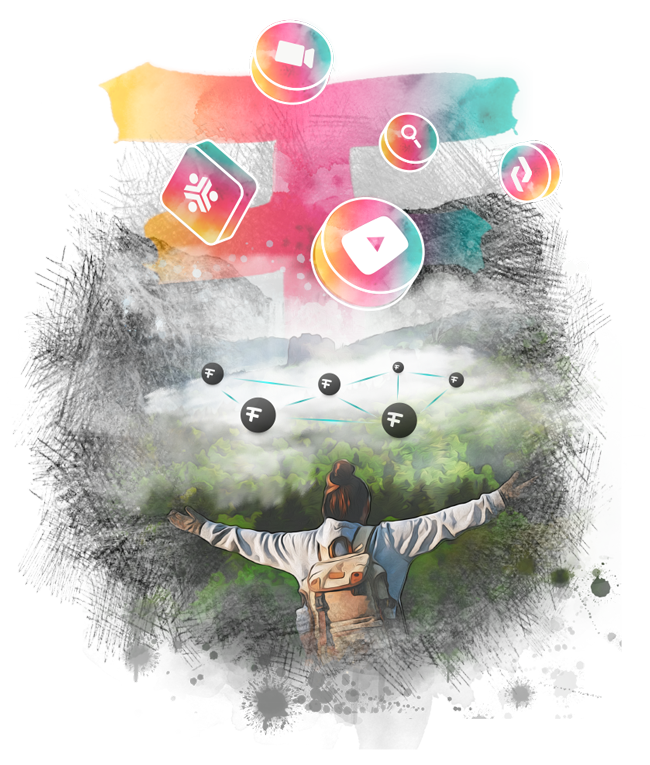

<!-- section 1 (header) -->



 

 

 

## DIGITAL FARMING {#text-8xl}

### Become a digital farmer for the FreeFlow network,  add decentralized storage and compute capacity, earn rewards. 

 

 

 

<button onclick="window.open('https://threefoldfoundation.github.io/books/freeflow/network/farming/farming_intro.html', '_blank')">KNOW MORE</button>



<!-- section 2 (BE THE INTERNET) -->



|||

## BE THE   INTERNET

By simply plugging in a FreeFlow Node, you can provide the services that the world’s largest tech companies provide to billions of users. 

 

<button onclick="window.open('https://threefoldfoundation.github.io/books/freeflow/network/farming/farming_intro.html', '_blank')">FULL DETAILS</button>





## THE FREEFLOW INTERNET   IS GROWING FAST

FreeFlow extends and has been built on top of the [threefold.io](http://www.threefold.io) project.





## THE FREEFLOW INTERNET   IS GROWING FAST





## EARN

Provide the compute, storage and network capacity needed to  store data and run applications on the FreeFlow Network and start earning




## THE FREEFLOW INTERNET   IS GROWING FAST


