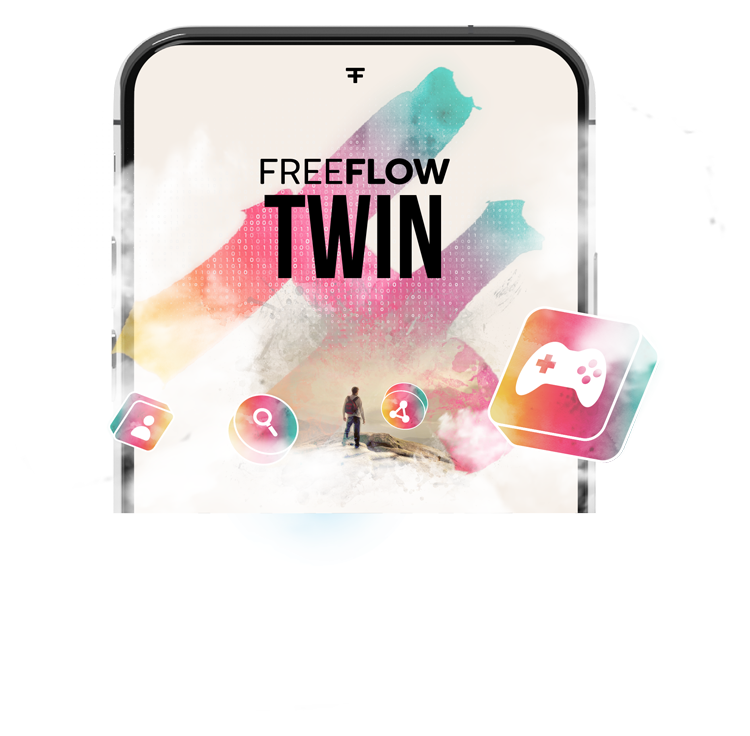
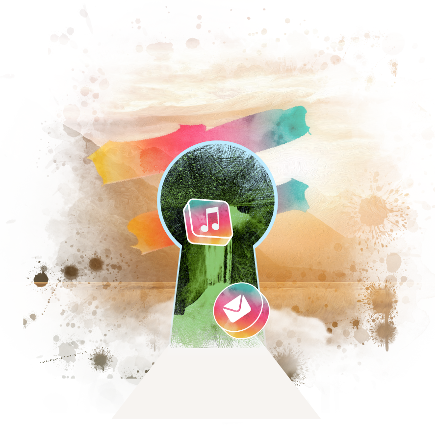
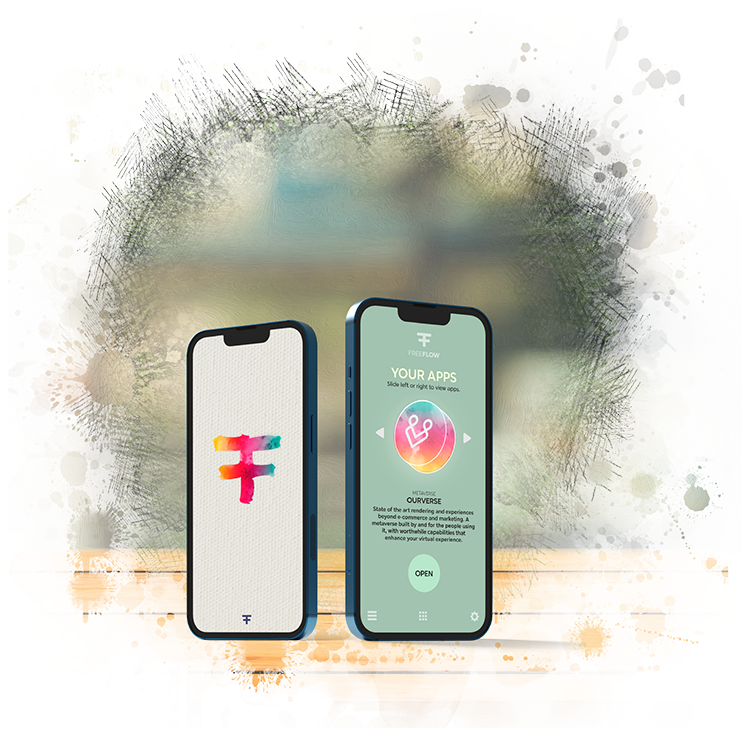

<!-- section 1 (heade FF TWIN) -->



 

### THE FREEFLOW TWIN

## own every   aspect of your   digital life

The FreeFlow Twin is your digital avatar.

<button>[KNOW MORE](/twin/#identity)</button>
<button onclick="window.open('https://threefoldfoundation.github.io/books/freeflow/network/buy/buy_my_twin.html', '_blank')">GET THE TWIN</button>

|||

 

 

 



<!-- section 2  -->



|||

### **THE FREEFLOW KEY**

## YOUR VALUABLE KEY   TO YOUR DIGITAL LIFE

To get access to your FreeFlow Twin you need a unique NTF known as a FreeFlow Key (FFK), these keys are valuable and unique.
<button class="flex mx-auto" onclick="window.open('https://threefoldfoundation.github.io/books/freeflow/network/tokens/ffk.html', '_blank')">MORE INFO</button>



<!-- section 3 (oldnew) -->



## DO ANYTHING.   DO EVERYTHING.

Your FreeFlow Twin comes with all required skills and capabilities.





## fflow_skills





|||

## FREE FLOWING   EXPERIENCES

Communicate, Explore and Collaborate with you in the center of your digital life. Your twin can be used as alternative to Whatsapp, Google Drive, Zoom, Facebook, Linkedin, ...

<button>[THE EXPERIENCES](/experiences)</button>





## THIS IS WHERE   DATA COMES   TOGETHER

### Quantum Safe Data Storage System

All your data is yours, can not be stolen, not corrupted nor lost.  Your data is usable over all your experiences. 

Your digital twin manages all of this for you. e.g. you can use same chat from your collaboration app or your metaverse exploration.

<button onclick="window.open('https://threefoldfoundation.github.io/books/freeflow/mytwin/intro/twin_architecture.html', '_blank')">ARCHITECTURE</button>

|||





## RIDICULOUSLY   GREEN.

A typical FreeFlow user consumes less than 1 watt to live their entire digital life. 

This ultra-sustainable approach allows the system to easily scale without being a burden to the planet. 

|||





|||

## LETS GET STARTED OWN YOUR TWIN

Become the center of your digital life and   Get your FreeFlow key now!

<button onclick="window.open('https://threefoldfoundation.github.io/books/freeflow/network/buy/buy_my_twin.html', '_blank')">GET THE TWIN</button>

