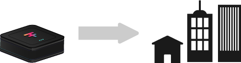

<!-- section 1 (heade FF TWIN) -->



### provide a platform which allows us to restore the original intent of the Internet where everyone is equal, communication is direct, secure and private where you can trust the information presented where everything is free without becoming a product.

<button>[KNOW MORE](/vision/#fflow_grid)</button>



<!-- section 2 (FF LIFE) -->



|||

## IT STARTS WITH   THE FREEFLOW NETWORK

People like you and me deploy FreeFlow Nodes to provide the required compute and storage capacity.  

Our unique operating system interconnects these nodes to create the FreeFlow Network, our own sovereign and decentralized Internet. 

<button>[KNOW MORE](/node)</button>





## fflow_grid





## GET YOUR FREEFLOW TWIN
### YOU BECOME THE CENTER OF YOUR INTERNET.

The FreeFlow Twin allows everyone to experience a more sustainable and safe Internet Life.  

By eliminating the need for centralized servers, the FreeFlow Twin allows you, the user, to be the only central point of data accumulation, communication and execution of digital capabilities.

<button>[KNOW MORE](/twin)</button>

 

|||





## fflow_twin





|||

## EXPERIENCES   ARE BEING CREATED

 

Numerous applications (experiences) will be available soon to users of the FreeFlow Network.  

Each experience is decentralized and allows users to be fully private and secure.

<button>[KNOW MORE](/experiences)</button>





## fflow_experiences





### Become part of this movement where we create  a new version of the internet with us in the center.

<button>[TAKE PART](/take-part)</button>

 

